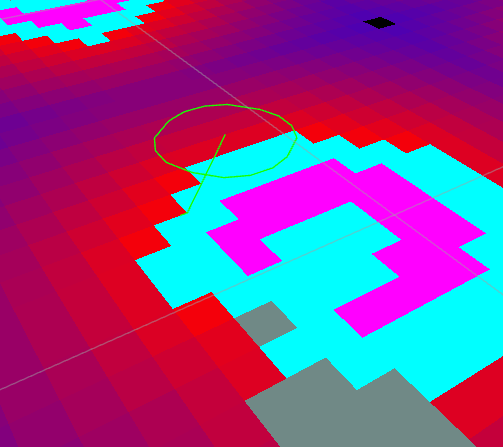
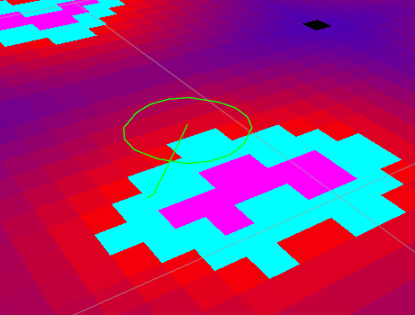

  
  
- [mk_nav2 项目说明](#mk_nav2-项目说明 )
  - [环境（Environment）](#环境environment )
  - [仓库结构（Repository Layout）](#仓库结构repository-layout )
  - [快速开始（Quick Start）](#快速开始quick-start )
    - [依赖包](#依赖包 )
  - [运行时控制（Runtime Controls）](#运行时控制runtime-controls )
  - [常见问题 & 调试（Troubleshooting）](#常见问题--调试troubleshooting )
  - [后续计划（TODO）](#后续计划todo )
  - [问题](#问题 )
  
# mk_nav2 项目说明
  
面向自主探索 + 建图 + 导航的一体化 ROS2 Workspace，主要包含三大模块：
  
- **autonomousr_explorer_bringup**：集中启动 Gazebo / SLAM Toolbox / Nav2 / RViz / FrontierExplorer / TaskManager 的 bringup 工程。
- **frontier_explorer**：负责 frontier 检测、目标选择、发送 `navigate_to_pose` 任务，并通过 `/exploration_state` 汇报状态。
- **task_manager**：编排高层任务流（建图启动、失败恢复、切换导航模式等），提供 `/start_mapping` / `/start_navigation` / `/stop_all` 等服务，并发布 `/task_manager_state`。
  

  
---
  
## 环境（Environment）
  
- Ubuntu 22.04 + ROS 2 Humble
- Nav2 + Gazebo（默认 TurtleBot3 Burger 模型）
- C++14，构建工具 colcon
  
---
  
## 仓库结构（Repository Layout）
  
```
mk_nav2/
├── README.md                      # 本文件
├── CHANGELOG.rst                  # 顶层变更记录
├── src/
│   ├── autonomousr_explorer_bringup/   # bringup/launch/config（Nav2、SLAM、TaskManager）
│   ├── frontier_explorer/              # 前沿检测节点
│   └── task_manager/                   # TaskFlow / TaskManagerNode
├── maps/                          # 静态地图输出/输入目录
├── log/, build/, install/         # 运行/构建产物，不会上传
└── image/                         # 示例图片
```
  
---
  
## 快速开始（Quick Start）
  
### 依赖包
  
构建前请确保 workspace 中包含以下自研依赖：
  
- `src/robot_interfaces`：定义 `/exploration_state`、`/task_manager_state` 使用的消息/服务。
- `src/util_package`：提供 `friendly_logging` 等公共头文件。
  
若从其它仓库只拷贝了 `mk_nav2` 目录，记得同步这两个包，否则编译会缺少接口定义。
  
1. **构建**
   ```bash
   cd ~/mk_nav2
   colcon build
   ```
2. **启动仿真 + Online SLAM**
   ```bash
   source install/setup.bash
   ros2 launch autonomousr_explorer_bringup full_system.launch.py
   ```
   - `full_system.launch.py`：Gazebo + SLAM Toolbox + Nav2（SLAM 模式）+ Frontier Explorer + TaskManager
   - `full_system_static.launch.py`：加载静态地图 + AMCL/Localization + Frontier Explorer + TaskManager
3. **基础服务**
   ```bash
   # 开始建图探索（TaskManager 会自动触发 /start_exploration）
   ros2 service call /start_mapping std_srvs/srv/Trigger {}
  
   # 切换到导航（要求 map_ready=true）
   ros2 service call /start_navigation std_srvs/srv/Trigger {}
  
   # 停止所有任务
   ros2 service call /stop_all std_srvs/srv/Trigger {}
   ```
4. **状态话题**
   - `/exploration_state` (`robot_interfaces/msg/ExplorationState`)
   - `/task_manager_state` (`robot_interfaces/msg/TaskManagerState`)
  
---
  
## 运行时控制（Runtime Controls）
  
- **建图流程**：调用 `/start_mapping` → TaskManager 进入 `EXPLORING` → 自动触发 `/start_exploration` → FrontierExplorer 连续挑选 frontiers。若出现 `STUCK` 或心跳超时，TaskManager 会停止并进入 `FAILED`，可根据日志或服务手动恢复。
- **探索完成**：FrontierExplorer 在某个 goal 成功后会上报 `COMPLETED`；TaskManager 会在 1 秒后自动再次调用 `/start_exploration`，直到你手动 `/stop_all` 或外部判定 `MAPPING_DONE`。
- **导航流程**：当地图准备好 (`map_ready=true`) 后，可调用 `/start_navigation`，Nav2 切换到导航模式。静态地图模式下需要在 `explore_map.yaml` 中写入 `map_directory` 和 `map_name`。
  
---
  
## 常见问题 & 调试（Troubleshooting）
  
1. **地图没扩张**：
   - 观察 `/map` header 是否更新；若时间在跳但尺寸不变，说明 SLAM 仍在固定栅格内更新，可调整 SLAM Toolbox 的 `map_size_x/y`、`map_start_pose` 或增大 Nav2 costmap 以便传感器看到未知区域外的空白。
   - 确保 `/scan` 按预期发布（`ros2 topic hz /scan`）并且 `slam_toolbox` 的 `scan_topic` 正确。
2. **TF old / controller Failed to make progress**：
   - 所有 Nav2 组件需要 `use_sim_time=true`。
   - 检查 `/tf` 中 `map->odom` 是否实时刷新 (`ros2 run tf2_ros tf2_echo map odom`)。
3. **Frontier 探索不启动**：
   - 确认启动 log 出现 `TaskManagerNode ready.`、`FrontierExplorerNode started.`。
   - 若 frontier 仍处于 IDLE，可以直接调用 `/start_exploration` 验证服务是否可用。
4. **Nav2 贴墙行走**：
   - 可调整 `nav2_exploration.yaml` 中 costmap 的 `robot_radius` / `inflation_layer` 参数，或在 DWB critic 中提高 `PathAlign`、`PathDist` 权重。
  
---
  
## 后续计划（TODO）
  
- Frontier selection：加入收益评估 + Cooldown 策略 + 地图更新检测。
- TaskManager：扩展多阶段任务状态机、导航模式切换、失败恢复策略。
- Nav2 参数持续调优，保证机器人在未知区域也能保持安全距离并遵循全局路径。
  
欢迎基于上述结构继续扩展或调试，更多细节可参考各包下的 `config/` 与 `launch/` 目录。
  
## 问题
  
**卡死在柱子上**
  
目前按还是有卡死的问题，更多来自于local和global的cost_map，后续会通过调参+退避策略解决。


  
**开始的时候map不会更新**
  
机器人最开始的时候会导出走，迫使map更新而后继续开始建模。
  
  