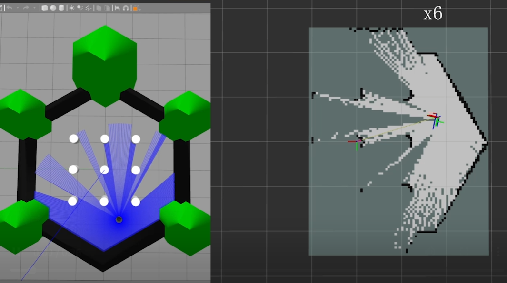
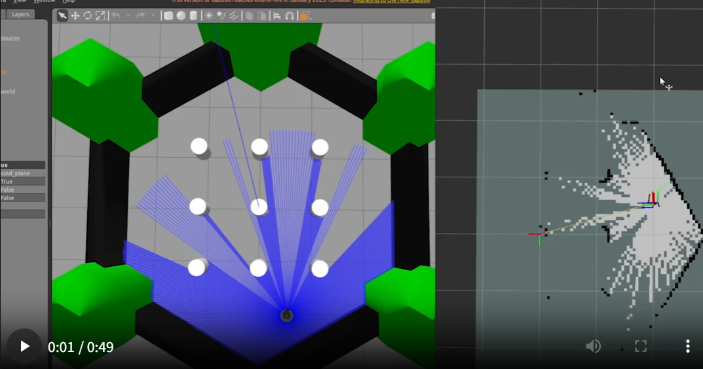

# mk_nav2

<p align="center">
  <a href="https://docs.ros.org/en/humble/">
    
  </a>
  <a href="https://releases.ubuntu.com/22.04/">
    
  </a>
  <a href="https://en.cppreference.com/w/cpp/17">
    
  </a>
  <a href="https://docs.nav2.org/">
    
  </a>
  <a href="https://github.com/SteveMacenski/slam_toolbox">
    
  </a>
  <a href="https://gazebosim.org/docs">
    
  </a>
</p>

<p align="center">
  <a href="https://colcon.readthedocs.io/en/released/">
    
  </a>
  <a href="https://docs.ros.org/en/humble/How-To-Guides/Ament-CMake-Documentation.html">
    
  </a>
  <a href="CHANGELOG.rst">
    
  </a>
  <a href="src/frontier_explorer/doc/frontier_explorer_node_doc.md">
    
  </a>
</p>

面向自主探索、在线建图和导航验证的一体化 ROS 2 Workspace。当前阶段已经完成了基于 frontier 的自主探索闭环：Gazebo 仿真、SLAM Toolbox 建图、Nav2 路径规划与控制、frontier 目标决策、TaskManager 任务编排可以通过 bringup 一起运行。

当前演示使用 **RPP（Regulated Pure Pursuit）控制器**。DWB 在本仓库当前场景下更容易出现抖动、原地调整或短暂停滞，依赖决策层兜底恢复；因此阶段性演示主要采用 RPP，并展示不同探索策略风格下的效果。

## 演示

> 两段视频均为 6 倍速。

| 策略风格 | 视频 | 说明 |
| --- | --- | --- |
| 激进探索 | [media/激进探索.mp4](media/激进探索.mp4) | 更偏向高收益 frontier，探索推进更快，但会更贴近未知边界。 |
| 保守探索 | [media/保守探索.mp4](media/保守探索.mp4) | 更强调风险抑制和候选兜底，路径选择更稳。 |


## 🎬 Demo Preview

### 激进探索

[](media/激进探索.mp4)

### 保守探索

[](media/保守探索.mp4)

[](media/激进探索.mp4)

[](media/保守探索.mp4)

<video src="media/激进探索.mp4" controls muted width="100%"></video>

<video src="media/保守探索.mp4" controls muted width="100%"></video>

## 当前能力

- 一键 bringup：仿真、SLAM、Nav2、RViz、FrontierExplorer、TaskManager 分阶段启动。
- 自主探索：基于 OccupancyGrid 检测 frontier，并通过 Nav2 `navigate_to_pose` 连续发送目标。
- 决策分层：frontier 决策拆成 Pruning、Scoring、Selection 三段，便于调参与扩展。
- 权重策略：通过 YAML 权重组合表达探索风格，不再依赖字符串策略类切换。
- 小边界兜底：小 frontier 不会被直接删除，但会延后到正常候选耗尽后再选择。
- 状态发布：探索节点发布 `/exploration_state`，TaskManager 汇总并发布 `/task_manager_state`。

探索节点这里只做概览。详细设计、状态机、参数和调试说明见：

<p>
  <a href="src/frontier_explorer/doc/frontier_explorer_node_doc.md">
    
  </a>
</p>

## 仓库结构

```text
mk_nav2/
├── README.md
├── CHANGELOG.rst
├── media/                              # 阶段性演示视频
├── maps/                               # 静态地图输入/输出目录
├── src/
│   ├── autonomousr_explorer_bringup/    # 统一 launch/config/rviz
│   ├── frontier_explorer/               # frontier 探索节点与决策模块
│   ├── task_manager/                    # 高层任务编排
│   ├── robot_interfaces/                # 自定义消息/服务
│   └── util_package/                    # 日志等公共工具
├── build/
├── install/
└── log/
```

## 模块概览

### autonomousr_explorer_bringup

集中管理系统启动入口和运行参数：

- `full_system.launch.py`：根据地图文件是否存在，自动选择 SLAM 探索或静态地图模式。
- `full_system_slam.launch.py`：在线 SLAM + Nav2 + RViz + FrontierExplorer + TaskManager。
- `full_system_static.launch.py`：静态地图定位 + Nav2 + RViz + FrontierExplorer + TaskManager。
- `config/nav2_exploration.yaml`：探索模式 Nav2 参数，当前 FollowPath 使用 RPP。
- `config/frontier_explorer.yaml`：frontier 决策权重与候选过滤参数。

### frontier_explorer

负责从 `/map` 中寻找 frontier，选择下一个探索目标，并调用 Nav2 action。当前决策链路是：

```text
FrontierDetector
  -> FrontierPruner
  -> FrontierScorer
  -> FrontierSelector
  -> NavigateToPose
```

其中 score component 以普通 C++ 类组织，不使用 ROS node、pluginlib 或动态插件。后续新增策略时，优先通过新增 score component 和调整 YAML 权重实现。

### task_manager

提供高层任务入口，负责把建图、探索、导航状态串起来：

- `/start_mapping`
- `/start_navigation`
- `/stop_all`
- `/task_manager_state`

## 快速开始

### 依赖

目标环境：

- Ubuntu 22.04
- ROS 2 Humble
- Nav2
- SLAM Toolbox
- TurtleBot3 Gazebo
- colcon

仓库内依赖：

- `robot_interfaces`
- `util_package`

### 构建

```bash
cd ~/mk_nav2
colcon build
source install/setup.bash
```

### 启动完整系统

```bash
ros2 launch autonomousr_explorer_bringup full_system.launch.py
```

`full_system.launch.py` 会先启动 Gazebo，然后根据 `explore_map.yaml` 指向的地图文件是否存在选择：

- 有地图：静态地图导航模式
- 无地图：SLAM 探索模式

### 启动探索

```bash
ros2 service call /start_mapping std_srvs/srv/Trigger {}
```

TaskManager 会进入建图流程，并触发 FrontierExplorer 开始选择 frontier 目标。

### 常用控制

```bash
# 直接启动 frontier 探索节点逻辑
ros2 service call /start_exploration std_srvs/srv/Trigger {}

# 停止 frontier 探索
ros2 service call /stop_exploration std_srvs/srv/Trigger {}

# 停止任务管理器中的当前任务
ros2 service call /stop_all std_srvs/srv/Trigger {}
```

### 常用状态话题

```bash
ros2 topic echo /exploration_state
ros2 topic echo /task_manager_state
ros2 topic echo /behavior_tree_log
```

## 策略配置

当前 frontier 决策通过 YAML 表达探索风格：

```yaml
frontier_decision:
  weight_distance: 1.0
  weight_cluster_size: 1.0
  weight_unknown_risk_penalty: 1.0
  candidate_unknown_margin_cells: 2
  candidate_max_unknown_ratio: 0.4
  defer_small_clusters: true
  small_cluster_size_threshold: 3
```

调参方向：

- 更激进：提高 `weight_cluster_size` 或启用信息增益类评分。
- 更保守：提高 `weight_unknown_risk_penalty`，降低 `candidate_max_unknown_ratio`。
- 保留小边界完备性：保持 `min_frontier_cluster_size` 较低，同时开启 `defer_small_clusters`。

当前实现中，小 cluster 不会被直接丢弃；当存在正常候选时，小 cluster 会延后选择，只有没有正常候选时才作为兜底目标。

## Nav2 控制器

当前探索配置使用 RPP：

```yaml
FollowPath:
  plugin: "nav2_regulated_pure_pursuit_controller::RegulatedPurePursuitController"
```

阶段性结论：

- RPP 在当前探索场景下更稳定，能更自然地对齐 path 并前进。
- DWB 可用作对比，但在窄边界、贴近未知区域和频繁重规划时更容易抖动或短暂停滞。
- 若看到 path 轻微贴近灰色区域，优先确认它是 unknown 还是 inflation/cost 区；`allow_unknown: false` 只禁止穿真正 unknown cell。

## 调试建议

### frontier 是否正常产生

```bash
ros2 topic echo /exploration_state
```

节点日志中会周期性输出 frontier cell 和 raw cluster 数量。

### Nav2 是否进入 recovery

```bash
ros2 topic echo /behavior_tree_log
```

重点观察：

- `ComputePathToPose`
- `FollowPath`
- `RecoveryActions`
- `Wait`

### 速度链路

当前主速度链路：

```text
controller_server -> /cmd_vel_nav -> velocity_smoother -> /cmd_vel -> turtlebot3_diff_drive
```

检查命令：

```bash
ros2 topic info /cmd_vel_nav -v
ros2 topic info /cmd_vel -v
ros2 topic echo /cmd_vel
```

## 当前阶段限制

- information gain 已接入 score component，但默认未启用。
- clearance score 预留了字段和组件，但当前候选 `clearance_m` 仍未接入真实 costmap 距离统计。
- 小边界探索已经通过延后选择保留完备性，但不同地图下可能仍然需要继续调权重。
- 真实机器人部署前还需要重新标定 footprint、inflation、速度限制和传感器噪声参数。

## 参考文档

- [Frontier Explorer 详细设计](src/frontier_explorer/doc/frontier_explorer_node_doc.md)
- [顶层变更记录](CHANGELOG.rst)
