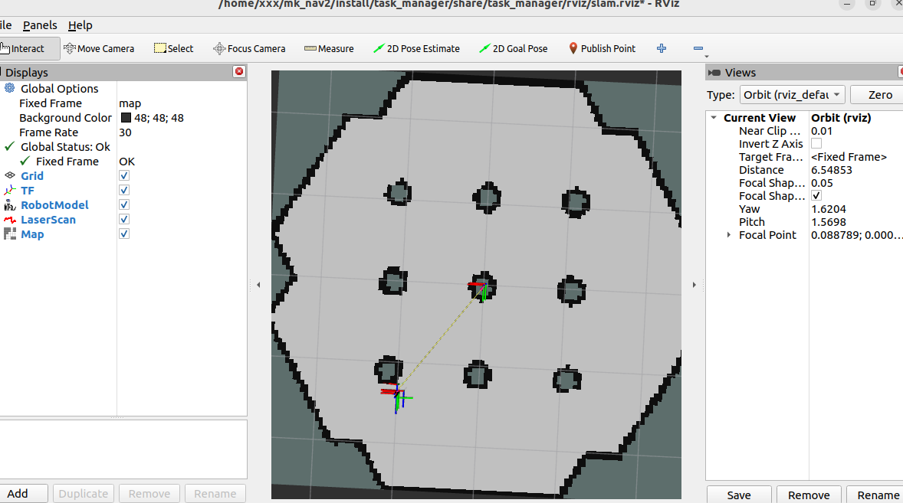

# 环境版本（Environment）

- OS: Ubuntu 22.04
- ROS: ROS 2 Humble
- Navigation: Nav2
- Simulator: Gazebo
- Language: C++/14
- Build tool: colcon

# 启动（Run it）

**构建（build）**

```bash
cd ~/mk_nav2   # 你的项目目录 your workspace
colcon build --packages-select task_manager frontier_explorer
```

**启动（Run）**
```bash
cd ~/mk_nav2 # 你的项目目录 your workspace
source install/setup.bash
ros2 launch task_manager sim_slam_bringup.launch.py # 启动
```

# 效果



# 目前问题


## Frontier_Expolorer
1）只选最近 frontier
后续会添加更多的算法

3）遇到障碍物的时候会在障碍物旁边等很久，计划last_goal_grid_。
4:54会等很久，大概6~7秒，大概7分钟建模完成。
目前看来他不是在原地打转。
目前的现象是：如果参数太过保守，机器人会卡在某一个点上。
一切都是正常的，但机器人就是不动，怀疑是ASML没有即时更新最新的地图点，导致机器人认为不可达，从而卡在原地。

4）没有动态识别障碍物的功能
