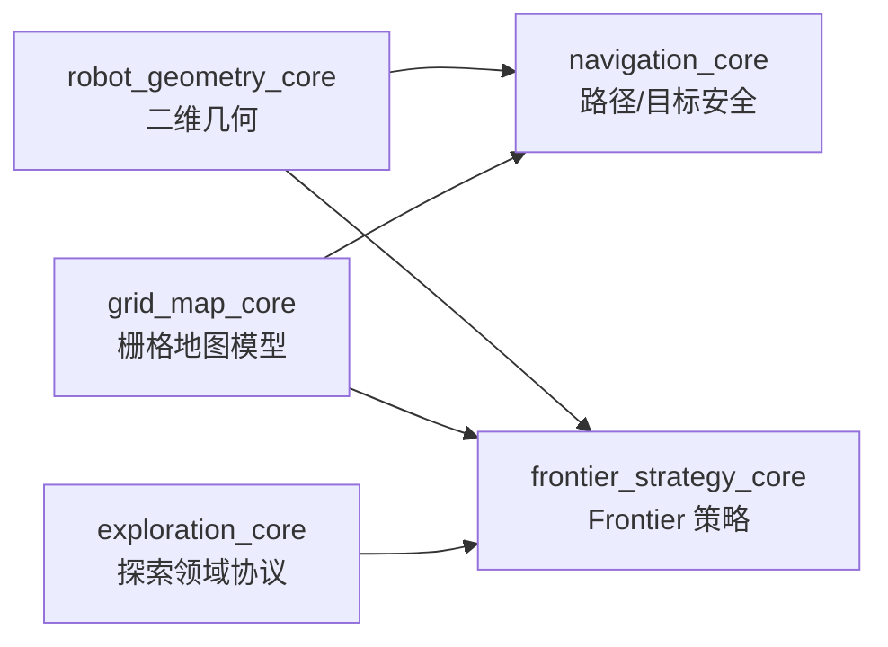
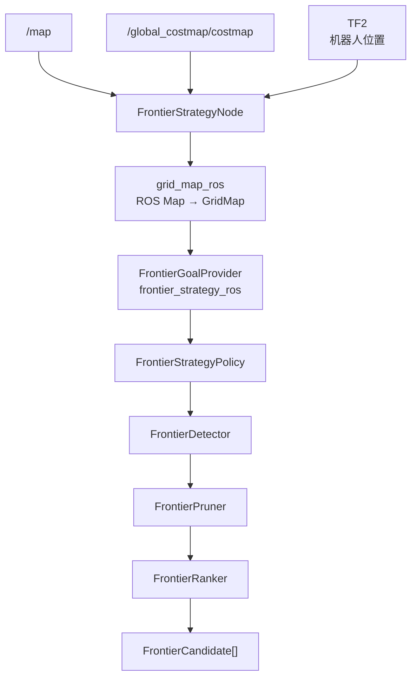
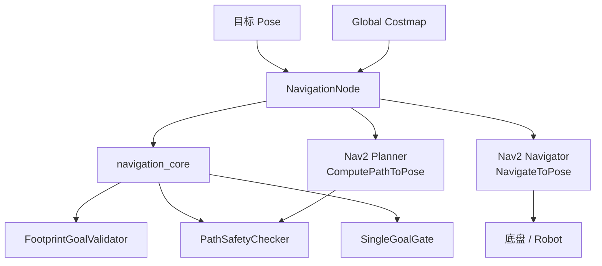
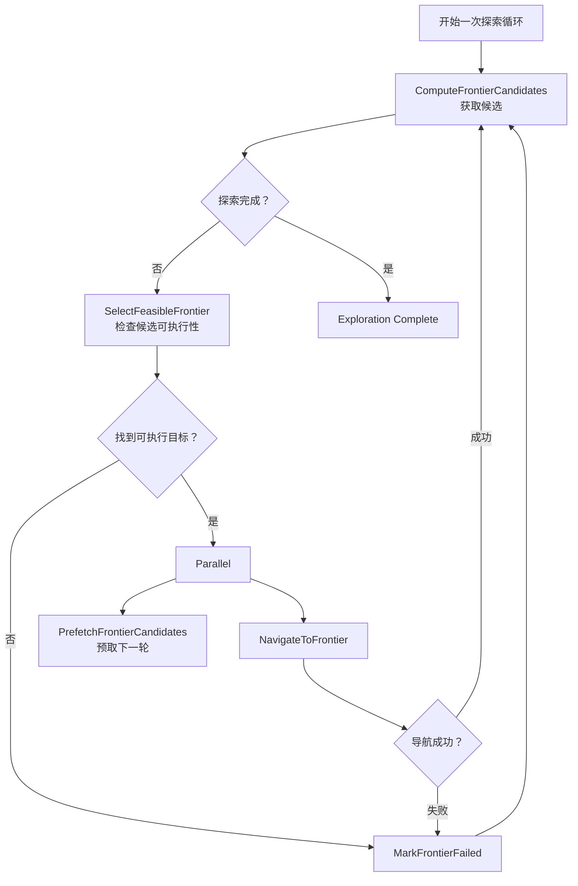
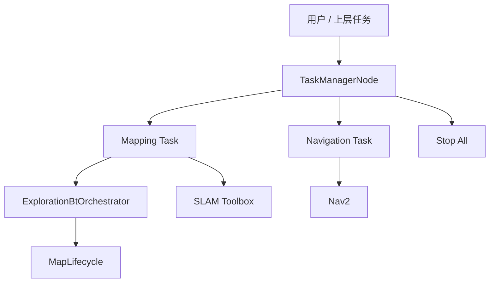
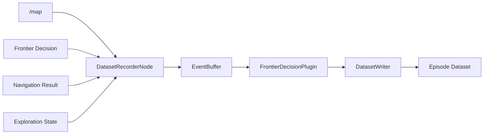
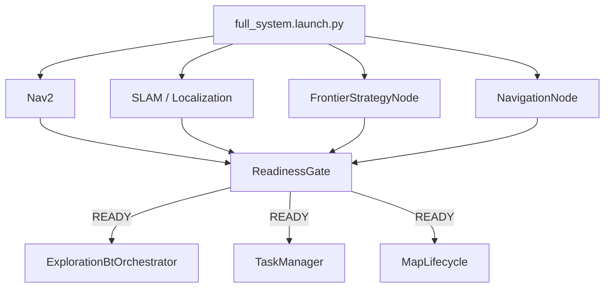
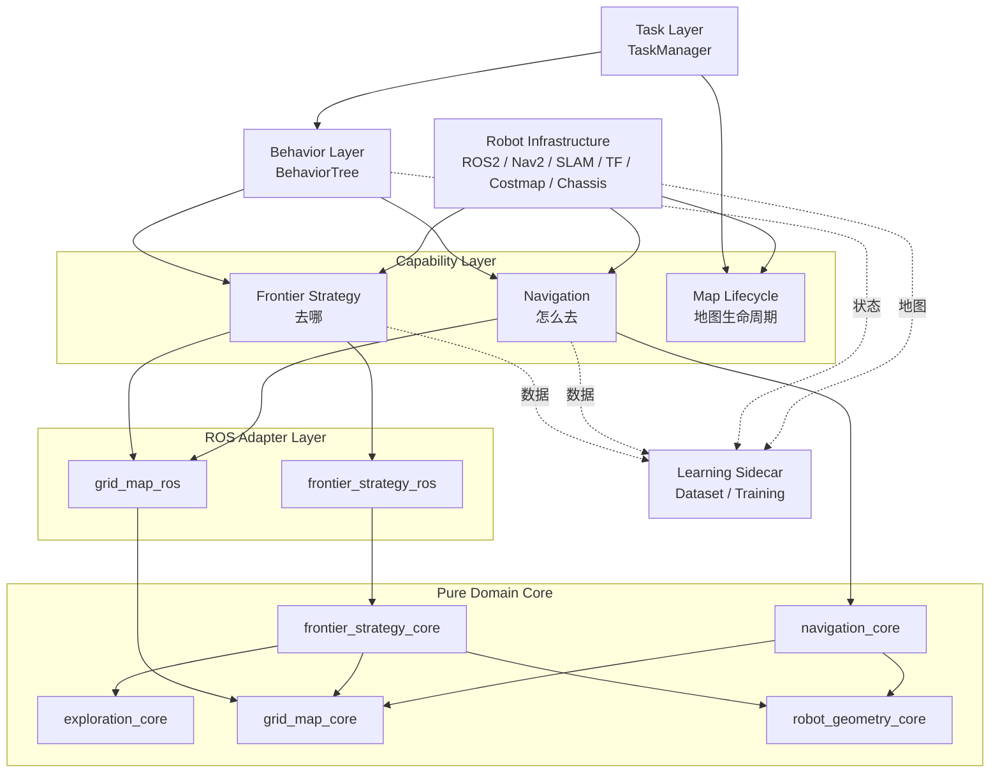
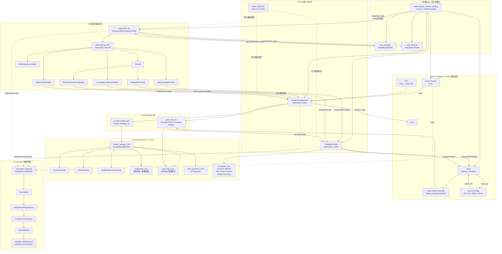

# 当前架构总览

> 状态：持续维护
>
> 同步基线：`d7be6c6`（2026-09-24）
>
> 说明：本文描述当前模块职责；具体接口和依赖以代码及测试为准。

## Pure Core


# Frontier：去哪儿



## 如何找的

```text
/map + /global_costmap/costmap + robot pose
        ↓
FrontierDetector
  找到“已知自由区 + 邻接未知区”
        ↓
8 邻域聚类
        ↓
FrontierPruner
  生成候选点并执行硬门禁
        ↓
RuleBasedFrontierRanker
(这里有问题，信息熵最开始其实可以大一点，后续应该以为准做一个动态)
  距离、簇大小、重试、未知比例、信息增益打分
        ↓
GetFrontierCandidates 返回候选列表
        ↓
BT SelectFeasibleFrontier
  调用 NavigationNode 检查可达性
（可达性的依据是什么是否是太严格了?）
        ↓
NavigateToFrontier
        ↓
导航过程中 Prefetch 下一轮候选
        ↓
导航成功后重新选择
```


# Navigation：能不能去 + 怎么去



# BT：把“去哪”和“怎么去”组合起来




# TaskManager：机器人现在到底在干嘛




TaskManager
├── Exploration
├── ReturnHome
├── Patrol
├── Mapping
├── NavigateToPoint
└── Docking


# Learning：旁路观察系统



# Bringup：整个系统怎么活起来




# 最后才汇总成宏观架构



# 总架构图

