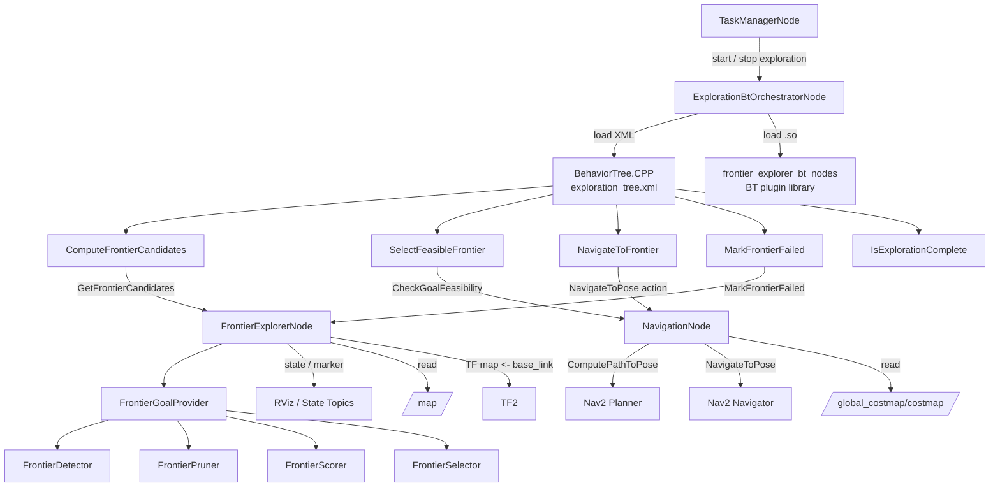

# Exploration 架构说明

## 目标

`frontier_explorer` 当前采用“能力节点 + BT 编排节点”的结构：

- `FrontierExplorerNode` 是 ROS wrapper，只负责 frontier 能力接口、订阅、marker 和 state。
- `FrontierGoalProvider` 是纯 C++ 能力类，负责检测、过滤、打分、选择和 retry / blacklist 策略状态。
- `ExplorationBtOrchestratorNode` 是唯一探索决策编排层。
- `NavigationNode` 是导航能力中间层，对 BT 暴露目标可执行性检查和稳定导航 action，内部组合 Nav2 planner / navigator / costmap。
- retry / blacklist 仍由 frontier 能力层内部维护，对外只暴露失败事件接口。

## 架构图



## 运行链路

```text
TaskManagerNode
  -> /exploration_bt_orchestrator_node/start_exploration
  -> ExplorationBtOrchestratorNode
  -> behavior_trees/exploration_tree.xml
  -> ComputeFrontierCandidates
      -> /frontier_explorer_node/get_frontier_candidates
  -> SelectFeasibleFrontier
      -> /navigation_node/check_goal_feasibility
  -> NavigateToFrontier
      -> /navigation_node/navigate_to_pose
      -> Nav2 NavigateToPose
  -> MarkFrontierFailed
      -> /frontier_explorer_node/mark_frontier_failed
```

探索结束由 `GetFrontierCandidates` 的 `exploration_complete` 字段驱动。

## 边界规则

- `FrontierExplorerNode` 只暴露 frontier 能力接口，不决定探索流程。
- `FrontierGoalProvider` 不依赖 action client，不发送 goal，不知道 BT tick 节奏。
- `ExplorationBtOrchestratorNode` / BT 负责什么时候请求 goal、什么时候导航、失败后什么时候重新选点、什么时候完成或失败。
- BT 不直接读取或修改 retry / blacklist 内部结构；它只通过 `mark_frontier_failed` 通知一次导航失败事件。
- retry 计数、blacklist 阈值、goal blacklist、cluster blacklist、clear 规则均由 `FrontierGoalProvider` 内部维护。
- `NavigationNode` / Nav2 负责目标可执行性检查和真正的 `NavigateToPose`。BT 插件不直接调用 Nav2 action。

## FrontierExplorerNode 职责

`FrontierExplorerNode` 是探索能力 ROS wrapper，负责：

- 订阅 `/map`。
- 可选订阅 `/global_costmap/costmap` 作为 clearance / safety scoring 输入。
- 通过 TF 查询 `global_frame <- robot_base_frame`，为能力层提供 map frame 下的机器人位姿输入。
- 托管 `FrontierGoalProvider`。
- 提供 frontier 能力服务。
- 发布 frontier marker。
- 发布 `/frontier_explorer/state`。
- 兼容发布旧 `/exploration_state`。

`enable_internal_navigation_loop` 已废弃并被忽略。节点不会主动发送 Nav2 goal。
默认 `show_all_candidate_markers: false`，RViz 中只显示最终选中候选球；需要调试完整候选集合时可改为 `true`。

## FrontierGoalProvider 职责

`FrontierGoalProvider` 是可单测的 C++ 能力类，负责：

- 维护 `CostmapAdapter`。
- 复用现有 `FrontierDetector`、`FrontierPruner`、`FrontierScorer`、`FrontierSelector`。
- 计算下一个 frontier goal。
- 接收 map frame 下的机器人位姿，不直接订阅 `/odom`，避免把漂移的 odom frame 当作 map frame 使用。
- 输出按分数排序的 frontier candidates；默认不在 provider 内部做 Nav2 planner 可达性过滤。
- 维护 retry / blacklist 的内部数据结构和更新规则。
- 返回 marker 发布所需的可视化快照。
- 不创建 ROS service、topic、timer 或 action client。

## ExplorationBtOrchestratorNode 职责

`ExplorationBtOrchestratorNode` 是唯一探索编排节点，负责：

- 加载可配置 BT XML。
- 加载 BehaviorTree.CPP 插件库。
- 提供 start / stop / pause / resume 服务。
- 周期 tick BehaviorTree。
- 调用 frontier goal 服务。
- 调用 frontier candidates 服务并在 BT 中选择可执行候选。
- 通过 NavigationNode action 触发导航。
- 导航失败时调用 `mark_frontier_failed`，但不直接操作 retry / blacklist。
- 根据 BT 结果决定继续请求 frontier、完成探索或进入失败状态。
- 发布 `/exploration_orchestrator/state`。

普通 C++ 状态机版 orchestrator 已删除，避免多套编排逻辑并存。

## NavigationNode 职责

`NavigationNode` 是探索系统内的导航能力中间层，负责：

- 对外提供 `/navigation_node/navigate_to_pose` action。
- 对外提供 `/navigation_node/check_pose_reachability` service。
- 对外提供 `/navigation_node/check_goal_feasibility` service。
- 内部调用 Nav2 `ComputePathToPose` action 检查候选目标可达性。
- 使用 `/global_costmap/costmap` 检查 goal pose 处 robot footprint 落脚碰撞。
- 审计 Nav2 planner 返回 path 是否穿越 unknown、costmap 外或高代价区域。
- 内部调用 Nav2 `NavigateToPose` action。
- 对探索导航 action 做单目标保护；已有 goal 执行或取消中时，新 goal 会被拒绝，避免多个外部 goal 抢占 Nav2。
- 桥接 Nav2 feedback，包括 current pose、remaining distance、recoveries 等。
- 桥接 cancel，BT 停止时由该节点取消 Nav2 goal。
- 将 Nav2 result 和 feasibility result 归一化为 `success`、`result_code` 和 `message`。

它不选择 frontier，不管理 retry / blacklist，也不决定探索是否完成。

## 服务接口

FrontierExplorerNode：

- `/frontier_explorer_node/get_frontier_candidates`
- `/frontier_explorer_node/get_next_frontier_goal`
- `/frontier_explorer_node/mark_frontier_failed`
- `/frontier_explorer_node/clear_frontier_blacklist`
- `/frontier_explorer_node/get_exploration_state`

NavigationNode：

- `/navigation_node/navigate_to_pose` (`robot_interfaces/action/NavigateToPose`)
- `/navigation_node/check_pose_reachability` (`robot_interfaces/srv/CheckPoseReachability`)
- `/navigation_node/check_goal_feasibility` (`robot_interfaces/srv/CheckGoalFeasibility`)

ExplorationBtOrchestratorNode：

- `/exploration_bt_orchestrator_node/start_exploration`
- `/exploration_bt_orchestrator_node/stop_exploration`
- `/exploration_bt_orchestrator_node/pause_exploration`
- `/exploration_bt_orchestrator_node/resume_exploration`

旧的 `/start_exploration` 和 `/stop_exploration` 仍由 `FrontierExplorerNode` 保留，仅用于兼容旧控制面。
新系统入口应使用 `exploration_bt_orchestrator_node`。

## 状态 topic

- `/frontier_explorer/state`: frontier 能力节点状态。
- `/exploration_orchestrator/state`: BT 编排流程状态。
- `/exploration_state`: 兼容旧 TaskManager / MapManager 的状态 topic。

## 参数约定

服务名和 action 名属于运行时拓扑配置，不通过 CMake 写死。默认值集中在：

```text
include/frontier_explorer_nodes/nodes/exploration_bt_defaults.hpp
```

生产部署应通过 YAML 覆盖：

```yaml
exploration_bt_orchestrator_node:
  ros__parameters:
    frontier_goal_service: /frontier_explorer_node/get_next_frontier_goal
    frontier_candidates_service: /frontier_explorer_node/get_frontier_candidates
    mark_failed_service: /frontier_explorer_node/mark_frontier_failed
    reachability_service: /navigation_node/check_pose_reachability
    goal_feasibility_service: /navigation_node/check_goal_feasibility
    navigation_action: /navigation_node/navigate_to_pose
    max_frontier_candidates: 8
    max_feasibility_recoverable_retries: 2
    feasible_path_length_weight: 0.6
    tick_period_sec: 0.1
    service_retry_delay_sec: 2.0

navigation_node:
  ros__parameters:
    navigation_action: ~/navigate_to_pose
    check_pose_reachability_service: ~/check_pose_reachability
    check_goal_feasibility_service: ~/check_goal_feasibility
    navigate_to_pose_action: navigate_to_pose
    compute_path_to_pose_action: compute_path_to_pose
    footprint_costmap_topic: /global_costmap/costmap
    enable_footprint_collision_check: true
    allow_unknown_footprint: false
    enable_path_safety_check: true
    allow_unknown_path: false
    robot_radius: 0.1
    footprint_padding: 0.0
    footprint_cost_threshold: 253
    path_cost_threshold: 253
    reachability_planner_id: ""
    nav2_server_timeout_ms: 1000
    reachability_timeout_ms: 2000
```

## 启动

单独启动 frontier 能力节点：

```bash
ros2 launch frontier_explorer_nodes frontier_explorer.launch.py
```

单独启动 BT 编排节点：

```bash
ros2 launch frontier_explorer_nodes exploration_bt_orchestrator.launch.py
```

启动探索：

```bash
ros2 service call /exploration_bt_orchestrator_node/start_exploration std_srvs/srv/Trigger {}
```

停止探索：

```bash
ros2 service call /exploration_bt_orchestrator_node/stop_exploration std_srvs/srv/Trigger {}
```

## 目录结构

```text
include/frontier_explorer_nodes/nodes/
  exploration_bt_context.hpp
  exploration_bt_defaults.hpp
  exploration_bt_orchestrator_node.hpp
  navigation_node.hpp
  bt/
    action/
      compute_next_frontier_goal_action.hpp
      compute_frontier_candidates_action.hpp
      mark_frontier_failed_action.hpp
      navigate_to_frontier_action.hpp
      select_feasible_frontier_action.hpp
      select_reachable_frontier_action.hpp
    is_exploration_complete_condition.hpp

src/nodes/
  frontier_explorer_main.cpp
  frontier_explorer_node.cpp
  navigation_main.cpp
  navigation_node.cpp
  bt/
    exploration_bt_context.cpp
    orchestrator/
      exploration_bt_orchestrator_main.cpp
      exploration_bt_orchestrator_node.cpp
    action/
      compute_next_frontier_goal_action.cpp
      compute_frontier_candidates_action.cpp
      mark_frontier_failed_action.cpp
      navigate_to_frontier_action.cpp
      select_feasible_frontier_action.cpp
      select_reachable_frontier_action.cpp
    is_exploration_complete_condition.cpp

include/frontier_explorer_core/
  frontier_goal_provider.hpp

src/core/
  frontier_goal_provider.cpp
```

## 后续扩展

1. 增加 `SaveMap`、`ReturnHome`、`ClearFrontierBlacklist` BT 节点。
2. 为 BT 节点增加单元测试或 launch smoke test。
3. 将候选选择策略参数化，例如可执行性失败后的 blacklist 批量策略。
4. 将普通探索和末期收尾探索拆成两个清晰策略阶段，避免主策略继续堆叠特殊规则。
5. 将 feasibility check 的临时 planner path 与真正导航 path 在 RViz 中区分显示，降低调试误判。

## 当前已知现象

- RViz 的 global path 在 `SelectFeasibleFrontier` 阶段可能短时间跳到不同候选点。当前判断主要来自候选可执行性检查连续调用 Nav2 `ComputePathToPose`，planner 临时 path 被显示出来；不一定表示真正 `NavigateToPose` goal 被反复发送。
- 探索末期可能残留单格 unknown。当前主策略为了避免毛刺和贴边目标，叠加了 small cluster 延后、unknown ratio、goal inset、footprint 检查、path safety 等约束；后续更适合引入 cleanup exploration 收尾模式。
- 策略链已经较长。继续在主策略中加例外规则会增加调参耦合，后续应按 normal / cleanup / recovery 分层。
